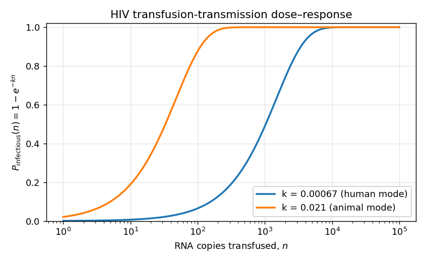
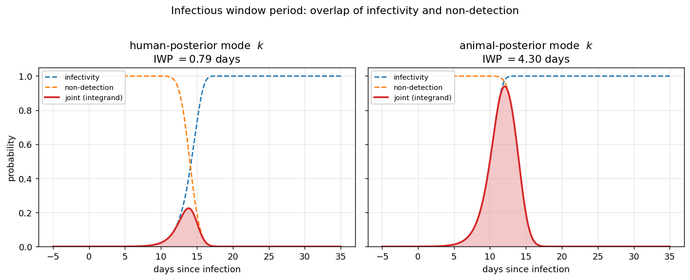
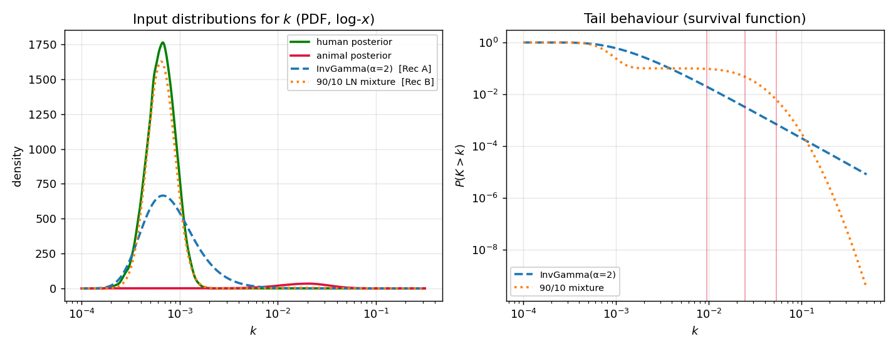

# Technical documentation: residual risk of HIV transfusion transmission

*Eduard Grebe — Vitalant Research Institute*

This document is the technical backing for the **Residual HIV Transfusion
Transmission Risk Estimation Tool**. It sets out the mathematics of the base
("mechanistic") model, the operational-data ("lookback") model, the numerical
methods used in their implementation, and the uncertainty analysis. It is written
for a scientific readership and is intended as a reference rather than a
manuscript; it documents the model **as currently implemented** in the
`residualrisk` Python package (and its Go acceleration), which extends the
originally published model (Grebe et al., 2020) in several respects noted
throughout.

> **Scope.** This version documents the **base mechanistic model** and the
> **lookback model**. The PrEP-breakthrough extension is documented separately.

---

## 1. Overview and general approach

The tool estimates the **residual risk** of HIV transmission through transfusion
of a blood component that has been screened by nucleic acid testing (NAT) but was
collected during the pre-/early-NAT window, before the infection became
detectable. Two quantities are central:

- the **infectious window period** (IWP), also called *risk-day equivalents*
  (RDE): the time interval during which a donation already carries infectious
  virus but is not yet detected by the screening assay; and
- the **incidence** of HIV in the donor population: the probability per unit time
  that a donor acquires infection.

Because sources of risk outside the early-infection window (laboratory error, rare
non-reactive viral variants) are believed to be negligible, the probability that a
random transfused component transmits HIV is, to a good approximation, the product
of incidence and the IWP. This "incidence × window-period" logic is well
established (Busch et al., 2005; Weusten et al., 2002, 2011). When incidence is
small — as for HIV in blood donors — the annual force of infection and the
observed incidence are essentially equivalent, and the residual risk per
transfusion is

$$
RR = \hat{I} \cdot IWP ,
$$

with $\hat I$ the incidence and $IWP$ in the same units of time. With $IWP$ in
days and incidence in cases per person-year, this is

$$
RR = \hat{I} \cdot \frac{IWP}{365.25}\,.
$$

For example, an incidence of 10 cases per 100,000 person-years and an IWP of 7
days give a per-transfusion risk of $\tfrac{7}{365.25}\cdot 0.0001 \approx
1.9\times10^{-6}$, or about 1 in 522,000 transfusions.

**Incidence is treated as external to the model.** The tool is agnostic as to how
incidence is estimated; in practice this requires either repeat-donor
seroconversion data or a biomarker-based ("recent infection") estimator applied to
first-time donors, with appropriate weighting by the donation mix, and possibly
adjustment for the probability that an infectious unit would be interdicted on
other markers (Kleinman et al., 1997). The tool's task is to estimate the IWP and
to combine it with a user-supplied incidence (mechanistic model), or to estimate
the IWP directly from lookback investigation data (lookback model).

This implementation follows the logic of Weusten et al. (2011) but diverges from
it in three principal ways (Grebe et al., 2020):

1. the probability of transmission as a function of time since infection is
   modelled with a log-linear viral-growth model (Fiebig et al., 2003) and the
   dose-response model of Belov et al. (2023), fit to a non-human-primate SIV
   transmission study (Ma et al., 2009), rather than a per-virion infectivity;
2. incidence is treated as an external input rather than being derived from
   repeat-donor donation patterns; and
3. uncertainty is propagated by Monte Carlo: distributions are specified for the
   key parameters and parameter sets are drawn to produce credible ranges around
   the IWP and residual-risk estimates.

---

## 2. Notation

| Symbol | Code variable | Description |
|---|---|---|
| $t$ | `t` | Time since infection (days) |
| $C(t)$ | `_concentration` | Viral concentration in donor plasma (virions/mL) |
| $C_0$ | `C0` | Initial concentration at $t=0$ (default $0.00025$) |
| $\lambda$ | `doubling_time` | Viral doubling time during ramp-up (days) |
| $\chi$ | `copies_per_virion` | RNA copies per virion (2 for HIV) |
| $k$ | `k` | Dose-response (infectivity) parameter |
| $n(t)$ | `n_copies` | RNA copies in the transfused component at time $t$ |
| $V_\text{trans}$ | `volume_transfused` | Transfused plasma volume (mL) |
| $X_{50}$ | `lod50` | 50% limit of detection (copies/mL) |
| $X_{95}$ | `lod95` | 95% limit of detection (copies/mL) |
| $z$ | `z` | $\Phi(z)=0.95$, i.e. $z = 1.6449$ |
| $\Phi(\cdot)$ | `scipy.stats.norm.cdf` | Standard normal CDF |
| $S_\text{pool}$ | `pool_size` | Number of samples per minipool |
| $m_\text{retest}$ | `retests` | Number of pool-resolution retests |
| $IWP$ | `risk_days`, RDE | Infectious window period / risk-day equivalents (days) |
| $\hat{I}$ | `incidence` | HIV incidence (force of infection) in the donor pool |
| $RR$ | — | Residual risk of transfusion transmission |

---

## 3. The mechanistic IWP model

The IWP is built from three time-dependent components — viral growth, the
probability that the component is infectious, and the probability that the
screening assay fails to detect the infection — and is obtained by integrating
the joint probability of being infectious **and** undetected over time.

### 3.1 Viral dynamics

As in the Weusten model, the viral load is assumed to grow log-linearly during
acute infection, throughout the pre-NAT and early NAT-detectable phases. The
concentration of virions (Weusten eq. A1) is

$$
C(t) = C_0 \, 2^{\,t/\lambda},
$$

with $C_0$ the initial concentration and $\lambda$ the doubling time during
ramp-up. As long as $C_0$ is low, its precise value does not affect the estimate
(it shifts the time origin without changing the window length).

### 3.2 Infectivity (dose-response)

The probability that a transfused component transmits HIV is modelled as a
single-hit exponential dose-response in the number of RNA copies transfused (Belov
et al., 2023):

$$
P_\text{infectious}(n) = 1 - e^{-k n},
$$

where $n$ is the number of RNA copies in the component and $k$ is the
dose-response parameter. The number of copies at time $t$ follows from the viral
load, the copies per virion ($\chi = 2$ for HIV), and the transfused plasma volume:

$$
n(t) = \chi \, C(t) \, V_\text{trans},
\qquad\text{so}\qquad
P_\text{infectious}(t) = 1 - \exp\!\big(-k\,\chi\,C_0\,2^{\,t/\lambda}\,V_\text{trans}\big).
$$

This formulation — a dose-response on the *total transfused dose* — differs from
Weusten et al., who derive a per-virion infectivity. The dose-response curve is
shown in Figure 1; note its strong dependence on $k$, which is the dominant driver
of the IWP (§5.2).



*Figure 1. The HIV transfusion-transmission dose-response $P_\text{infectious}(n)
= 1 - e^{-kn}$, for $k$ at the human- and animal-data posterior modes. The 31-fold
difference in $k$ shifts the curve by more than an order of magnitude in dose.*

### 3.3 NAT non-detection

Following Weusten et al. (2011), the probability that a screened donation escapes
detection is parameterised through the probability of a positive result on the
initial (minipool) test and the probability that all pool-resolution retests are
negative (which could lead to release of the component). NAT responds to the viral
RNA **concentration** in the tested sample, so — unlike the dose-response, which is
driven by the absolute copy dose $n(t) = \chi\,C(t)\,V_\text{trans}$ — the detection
curve is written in terms of a concentration $\tilde c$ (copies/mL). The probability
that any single test is positive at a tested-sample concentration $\tilde c$ is a
probit (log-dose) detection curve (Weusten eq. A5):

$$
P_{+}(\tilde c) = \Phi\!\left( z \, \frac{\log_{10}\!\big(\tilde c / X_{50}\big)}
{\log_{10}\!\big(X_{95}/X_{50}\big)} \right),
$$

with $X_{50}$ and $X_{95}$ the 50% and 95% limits of detection (copies/mL), $\Phi$
the standard normal CDF, and $z = 1.6449$ so that $\Phi(z)=0.95$. The calibration is
anchored by the LoD ratio: at $\tilde c = X_{50}$ the argument is $0$ and
$P_+ = 0.5$; at $\tilde c = X_{95}$ the argument is $z$ and $P_+ \approx 0.95$.

For an initial test of a **minipool of $S_\text{pool}$ samples**, the donor sample
is diluted by the pool, so the tested-sample concentration is
$\tilde c = \chi\,C(t)/S_\text{pool}$ (Weusten eq. A7):

$$
P_{+,\text{init}}(t) = \Phi\!\left( z \,
\frac{\log_{10}\!\big( \chi C(t) / (S_\text{pool} X_{50}) \big)}
{\log_{10}\!\big(X_{95}/X_{50}\big)} \right).
$$

Components are released only if **all** retests are negative. Pool-resolution
retests are performed on the **individual donation** (undiluted), so the
tested-sample concentration is $\tilde c = \chi\,C(t)$ and $S_\text{pool}$ does not
appear:

$$
P_{-,\text{retest}}(t) = \left( 1 - \Phi\!\left( z \,
\frac{\log_{10}\!\big( \chi C(t) / X_{50} \big)}
{\log_{10}\!\big(X_{95}/X_{50}\big)} \right) \right)^{m_\text{retest}}.
$$

A unit is detected only if the initial pool test is positive *and* at least one
retest is positive; the probability of **non-detection** is therefore (Weusten
eq. A6):

$$
P_\text{non-detection}(t) = 1 - P_{+,\text{init}}(t)\,\big(1 - P_{-,\text{retest}}(t)\big).
$$

When no retest can release a unit ($m_\text{retest}=0$), $P_{-,\text{retest}}$ is
defined as $0$ — not the $x^0 = 1$ that the power above would otherwise give —
because with no retest there is no retest-based release path. Detection then reduces
to the initial test, $P_\text{non-detection}(t) = 1 - P_{+,\text{init}}(t)$, and the
implementation special-cases $m_\text{retest}=0$ to this value.

Notes on the testing algorithm:

- Retesting matters only insofar as a unit can be released despite an initial
  positive (e.g. an initially reactive pool with a negative individual retest). We
  assume that if multiple retests are performed, **all** must be negative for
  release. The presence of retesting therefore increases risk relative to
  automatic interdiction on an initial positive; among algorithms that do retest,
  more retests reduce risk. `retests` should be set greater than zero only if a
  retest result could actually lead to release.
- For individual-donation NAT (ID-NAT) with automatic interdiction on a reactive
  result, set $S_\text{pool}=1$ and $m_\text{retest}=0$.
- If a multiplexed screening assay is used, the sensitivity of the discriminatory
  assay is irrelevant unless the algorithm permits release on a failure to
  discriminate; the model could be extended to such algorithms by the same logic.

### 3.4 The infectious window period

The IWP (risk-day equivalents) is the area under the joint probability of being
infectious and undetected (Weusten eq. A10):

$$
IWP = \int_{-\infty}^{\infty} P_\text{infectious}(t)\, P_\text{non-detection}(t)\; dt .
$$

The integrand has **compact effective support**: it is essentially zero before the
component carries an infectious dose and again once the load is high enough to be
reliably detected. Figure 2 shows the integrand as the overlap of the rising
infectivity curve and the falling non-detection curve; its area is the IWP. The
position and width of this overlap — and hence the IWP — depend strongly on $k$.



*Figure 2. The IWP as the overlap of infectivity (rising) and non-detection
(falling), for a representative minipool-NAT / pRBC scenario ($S_\text{pool}=16$,
$m_\text{retest}=1$, $V_\text{trans}=20$ mL, $X_{50}=2.73$ c/mL). Left: $k$ at the
human-posterior mode; right: $k$ at the animal-posterior mode. Higher $k$ makes
the component infectious earlier, widening the window (IWP 0.8 vs 4.3 days).*

### 3.5 Worst-case (single-virion) variant

A conservative variant replaces the dose-response with the assumption that a
single virion is guaranteed to transmit — i.e. $P_\text{infectious}$ steps from 0
to 1 when the component first contains one virion ($n \ge \chi$). This is the
analogue of setting Weusten's per-virion infectivity to 1. Combined with
conservative detection assumptions (e.g. the upper-confidence-limit LoD), it
yields a worst-case IWP; Grebe et al. (2020) reported a worst-case pRBC IWP of
8.81 days, similar to the 9-day presumed-infectivity-to-MP-NAT window of Busch et
al. (2005). The variant is implemented (`_prob_infectious_*_wc`) but is **not**
wired into the bootstrap; it is available for scenario analysis.

---

## 4. Numerical methods

This section documents the numerical implementation, which has been hardened
relative to the original 2020 code.

### 4.1 Numerical integration

The IWP integral is evaluated by **fixed-order Gauss–Legendre quadrature** over a
finite interval that safely brackets the integrand's support, $[-100, 500]$ days:

$$
IWP \approx \frac{b-a}{2} \sum_{i=1}^{N} w_i \;
g\!\left( \frac{b-a}{2} x_i + \frac{a+b}{2} \right),
\qquad g(t) = P_\text{infectious}(t)\,P_\text{non-detection}(t),
$$

with $\{x_i, w_i\}$ the $N=1000$ Legendre nodes and weights on $[-1,1]$ and
$(a,b)=(-100,500)$. Both backends use the same rule (NumPy
`numpy.polynomial.legendre.leggauss`; Go `gonum/integrate/quad.Fixed`), so they
agree to machine precision.

**Why a fixed rule rather than adaptive quadrature.** The original implementation
used adaptive Gauss–Kronrod (`scipy.integrate.quad`). On an integrand with compact
support, adaptive quadrature can place its initial nodes outside the active window
and **silently return ≈ 0**, missing the peak. A fixed 1000-point rule samples the
whole interval and cannot miss it. Adaptive `quad` remains available on the Python
path (`integration_method="quad"`) for reproducing prior analyses; it is rejected
when Go acceleration is requested, because the Go backend implements only
Gauss–Legendre.

### 4.2 Numerical guards

- **Growth overflow.** $2^{t/\lambda}$ overflows IEEE-754 double precision far out
  in the integration tail. The Python path caps the exponent at
  $t/\lambda \le 700$ before exponentiation; this is mathematically inert (the
  integrand is already 0 there, because the load saturates every detection
  probability) and only prevents a Python `OverflowError`. The Go path relies on
  IEEE-754 returning $+\infty$ (and the downstream $1-e^{-\infty}=1$,
  $\Phi(+\infty)=1$), giving the same result.
- **Probability clamping.** The dose-response is clamped to $[0,1]$ in both
  backends.

### 4.3 Go acceleration and RNG independence

The model is implemented twice: a reference implementation in Python
(`residualrisk/core.py`) and a high-performance reimplementation in Go
(`go/riskdays/`, exposed as the `riskdays_go` binary), invoked from Python via a
JSON/binary subprocess bridge (`residualrisk/_go.py`). The Go path is 10–50×
faster (a goroutine worker pool vs Python's `ProcessPoolExecutor`) and is the
default for interactive use; it falls back to Python automatically if the binary
is unavailable.

The two backends use **independent random number generators** (NumPy's PCG-64
legacy generator vs gonum's `exprand`/standard-library `rand`). Consequently, for
a given seed they do **not** reproduce each other draw-for-draw; they agree
**distributionally**. Equivalence between the backends is verified statistically
(point estimates from the deterministic "primary parameters" path agree to ~$10^{-9}$;
bootstrap medians and credible intervals agree within Monte Carlo tolerance).

---

## 5. Uncertainty analysis

Point estimates of the IWP and residual risk are obtained by evaluating the model
at the primary parameter values. To produce credible intervals, the tool performs
a Monte Carlo (bootstrap) analysis: a distribution is specified for each important
parameter, and a parameter set is drawn in each of $n_\text{bs}$ iterations
(default 10,000). Important caveats, unchanged from the original formulation:

- the distributions express *beliefs about inputs*; they have no meaning within
  the mechanistic model itself;
- parameters are drawn **independently** (the implementation does not model
  parameter correlations); and
- because $X_{50}$ and $X_{95}$ are highly correlated (both derive from a single
  probit calibration), the ratio $X_{95}/X_{50}$ is held fixed and only $X_{50}$
  is varied.

### 5.1 Parameter distributions and the positivity correction

| Parameter | Distribution | Sampler |
|---|---|---|
| $\lambda$ (doubling time) | Positive-truncated normal $\mathcal{N}(\lambda, \sigma_\lambda)\,\vert\,x>0$ | `_sample_positive_normal` |
| $X_{50}$ (50% LoD) | Positive-truncated normal $\mathcal{N}(X_{50}, \sigma_{X_{50}})\,\vert\,x>0$ | `_sample_positive_normal` |
| $V_\text{trans}$ (volume) | Uniform $\mathcal{U}(V_\text{min}, V_\text{max})$ | `numpy.random.uniform` |
| $k$ (infectivity) | see §5.2 | various |
| $\hat I$ (incidence) | Positive-truncated normal (in `residual_risk_rd`) | `_sample_positive_normal` |

**The positivity correction.** Physical parameters such as the doubling time, LoD,
and incidence must be positive, so their normal sampling distributions are
truncated at zero. The correct truncation is achieved with a draw from
$\mathcal{N}(\mu, \sigma)$ restricted to $(0, \infty)$, implemented via
`scipy.stats.truncnorm.rvs(a=-mu/sigma, b=inf, loc=mu, scale=sigma)` (Go:
rejection sampling, redrawing while $x \le 0$). The lower bound passed to
`truncnorm` is in **standard deviations from the mean**, hence $a = -\mu/\sigma$,
*not* $a = 0$. A prior version used $a=0$, which truncates at the **mean** rather
than at zero, discarding the entire lower half of the distribution and inflating
the sampled mean by approximately $0.8\,\sigma$. The correction de-biases the
draws; its effect on the IWP scales with the coefficient of variation of the
truncated parameter (for the production doubling-time SD it is a few percent).

### 5.2 The input distribution for the infectivity parameter $k$

The choice of input distribution for $k$ is the single most influential modelling
decision (Figures 1–2): the IWP, and hence the residual-risk estimate, depend on
$k$ far more strongly than on any numerical or sampling refinement. The tool
therefore supports several input distributions for $k$. This section sets out the
underlying posteriors, the design considerations, the candidate families, and the
recommended specifications. (A more exhaustive treatment, with additional
parameter sweeps and figures, is maintained in the companion analysis,
`residualrisk_analysis/exploration/K_PARAM_INPUTDIST.md`.)

#### 5.2.1 The estimated posteriors

Two Bayesian posteriors for $k$ have been estimated from different data sources and
are shipped with the tool as pre-computed MCMC samples (40,000 draws each) in
`static/`:

| | Human posterior | Animal posterior |
|---|---|---|
| File | `k_param_human.parquet` | `k_param_animal.parquet` |
| Mode (KDE) | 0.000673 | 0.020918 |
| Median | 0.000724 | 0.024464 |
| Mean | 0.000755 | 0.026991 |
| 95% interval | 0.00037–0.00131 | 0.0077–0.061 |
| log-scale $(\mu,\sigma)$ | $(-7.2403,\,0.3241)$ | $(-3.7423,\,0.5258)$ |

The animal posterior is centred roughly **31× higher** than the human posterior,
with the two 95% intervals essentially disjoint. A third posterior,
`k_param_expdecay.parquet` (a human-weighted exponential-decay distribution), is
also available. The human posterior is the primary evidence for transmissibility
in humans; the animal posterior reflects the higher infectivity observed in animal
models and is treated as informing the *upper tail* of plausible values. A
suitable input distribution should peak with the human data but assign
non-negligible probability to the animal range.

#### 5.2.2 Available input distributions

The tool can sample $k$ from any of the following. They are **mutually exclusive**: exactly one
must be specified, and supplying more than one — or a partially-specified one — raises an error.
(These were formerly a silent priority cascade in which the first one specified won, so a leftover
posterior sample could quietly override a parametric distribution the caller had asked for.)

1. **A raw posterior sample** — bootstrap draws (with replacement) from one of the
   posterior arrays above (human, animal, or exponential-decay). Selected by
   passing `k_posterior_sample`.
2. **Inverse Gamma** — `sample_invgamma(n, alpha, beta=None, mode=None)`. If
   $X \sim \mathrm{InvGamma}(\alpha, \beta)$ then $\text{mode} = \beta/(\alpha+1)$
   and the survival function has a power-law tail $P(X>x)\sim x^{-\alpha}$. The
   mode may be specified directly (then $\beta = \text{mode}\cdot(\alpha+1)$).
   Maps to `scipy.stats.invgamma(a=alpha, scale=beta)`.
3. **Two-component lognormal mixture** — `sample_lnmix(n, w, mu1, sigma1, mu2,
   sigma2)`: draw from $\mathrm{LN}(\mu_1,\sigma_1)$ with probability $w$, else
   from $\mathrm{LN}(\mu_2,\sigma_2)$. The $\mu,\sigma$ are log-scale
   ($\equiv$ `scipy.stats.lognorm(s=sigma, scale=exp(mu))`).
4. **Gamma** (legacy) — `numpy.random.gamma(shape, scale)`; retained for
   backwards compatibility. Its exponentially-bounded tail cannot reach the animal
   range, so it is deprecated for new analyses.

All four are implemented identically in Python and Go.

#### 5.2.3 Design criteria and candidate families

A suitable single input distribution for $k$ should (i) peak near the human-data
mode (≈ 0.000673), (ii) become non-negligible at roughly the human posterior's
lower edge (≈ 0.0003), (iii) carry a tail heavy enough to reach the animal range
($k \approx 0.01$–$0.07$), (iv) be unimodal or a simple mixture, and (v) be a
standard, efficiently-samplable distribution. There is an inherent tension between
(i)/(ii) and (iii): any single-family distribution with its mode at the human value
and a tail reaching the animal range must have a median/mean noticeably above the
human posterior's. Candidate families (all pinned to mode 0.000673):

| Distribution | Mode | Median | $P(k>0.02)$ | Tail | Variance |
|---|---|---|---|---|---|
| Human posterior | 0.000673 | 0.000724 | ~0% | — | finite |
| Animal posterior | 0.020918 | 0.024464 | ~50% | — | finite |
| Lognormal ($\sigma=1.0$) | 0.000673 | 0.001829 | 0.84% | sub-exponential | finite |
| **Inverse Gamma ($\alpha=2$)** | 0.000673 | 0.001203 | 0.48% | power-law $x^{-2}$ | $\infty$ |
| Log-logistic ($c=2$) | 0.000673 | 0.001166 | 0.34% | power-law $x^{-2}$ | $\infty$ |
| Gamma | 0.000673 | 0.001130 | ~0% | exponential | finite |
| **90/10 lognormal mixture** | 0.000649 | 0.000750 | 6.26% | empirical (animal) | finite |

The **Gamma** is rejected (its tail cannot reach the animal range). The
**lognormal**, **inverse gamma**, and **log-logistic** are viable single families;
the inverse gamma has the tightest bulk for a given tail reach and a genuine
power-law tail. The **mixture** uniquely preserves the human posterior's peak
(its median, 0.00075, is within 4% of the human median) while assigning explicit
weight to the animal range. Figure 3 contrasts the two recommended choices against
the posteriors.



*Figure 3. Left: input-distribution PDFs (log-$x$) against KDE-smoothed human and
animal posteriors. Right: survival functions $P(K>k)$ (log–log) with the animal
posterior's P5/P50/P95 marked. The InvGamma has a smooth power-law tail; the
mixture tracks the human peak and lifts an explicit 10% of mass into the animal
range.*

#### 5.2.4 Recommendation A — Inverse Gamma $(\alpha=2,\ \beta=0.002019)$

A smooth, unimodal, single-family distribution. Mode $=0.000673$ (matches the
human mode), median $=0.001203$, mean $=\beta/(\alpha-1)=0.002019$, **infinite
variance** (the power-law $x^{-2}$ tail), with $P(k>0.02)=0.48\%$ and
$P(k>0.05)=0.079\%$. The infinite variance is not a numerical problem — Monte
Carlo draws are always finite — it simply reflects that a distribution spanning
two orders of magnitude has no single characteristic spread. The shape parameter
$\alpha$ tunes tail heaviness while the mode is held fixed via
$\beta = 0.000673\,(\alpha+1)$:

| $\alpha$ | Median | $P(\text{human 95\% CI})$ | $P(\text{animal 95\% CI})$ | Character |
|---|---|---|---|---|
| 1.5 | 0.001422 | 43.6% | 6.39% | Very heavy tail; rump at edge of human range |
| **2.0** | 0.001203 | 51.7% | 2.83% | **Recommended** — balanced |
| 3.0 | 0.001007 | 63.8% | 0.54% | Bulk firmly in human range |
| 5.0 | 0.000864 | 78.6% | 0.02% | Animal range barely touched |
| 10.0 | 0.000766 | 93.3% | <0.001% | Almost entirely human |

$\alpha=2$ is a deliberately conservative choice: it is far heavier-tailed than a
best-fit inverse gamma to the human posterior alone (which would be
$\alpha\approx 9.5$), encoding substantial additional uncertainty toward the
animal range.

```python
from scipy.stats import invgamma
invgamma(a=2.0, scale=0.002019)        # mode 0.000673, median 0.001203
```

#### 5.2.5 Recommendation B — 90/10 lognormal mixture

An explicit weighting of human vs animal evidence:

$$
0.90 \times \mathrm{LN}(\mu=-7.2403,\ \sigma=0.3241)
\;+\; 0.10 \times \mathrm{LN}(\mu=-3.7423,\ \sigma=0.5258),
$$

i.e. each component is fit to one posterior. Mode $\approx 0.000649$, median
$\approx 0.000750$ (within 4% of the human median), mean $\approx 0.003389$,
finite variance, with $P(k>0.02)=6.26\%$. Interpretation: *with 90% probability
the human data apply directly; with 10% probability transmissibility is closer to
the animal-model range.* The mixture is mildly **bimodal** on the log scale — a
small secondary bump near the animal mode, with a low-density valley around
$k\approx0.002$–$0.008$ — which expresses an "either/or" belief rather than a
smooth continuum. The mixing weight is a transparent lever for sensitivity
analysis. The production UI default uses these parameters.

| Animal weight $1-w$ | Median | $P(k>0.02)$ | $P(\text{animal 95\% CI})$ |
|---|---|---|---|
| 10% (90/10) | 0.000751 | 6.3% | 9.5% |
| 20% | 0.000795 | 12.5% | 19.0% |
| 30% | 0.000861 | 18.8% | 28.4% |
| 50% | ≈ 0.0027 † | 31.3% | 47.4% |

† At a 50/50 weight the two lognormal components are so well separated that the
mixture CDF is nearly flat across the inter-mode valley ($k \approx 0.002$–$0.008$),
so the median is ill-conditioned — a small change in weight moves it a long way, and
the empirical (sampled) median is noticeably higher than this CDF-crossing value. The
figure is indicative only; the 50/50 mixture is not a recommended configuration.

The tail probability in the animal range scales almost linearly with the animal
weight; the global mode is stable at the human location for all weights (the human
component is far sharper and taller).

#### 5.2.6 Choosing between them

The single-family inverse gamma produces a smooth, unimodal, continuously
right-skewed input — conservative in that it places some probability on *every*
value between the human and animal ranges. The mixture best preserves the human
peak and gives explicit, interpretable control over the animal weight, at the cost
of mild bimodality and a subjective mixing weight. Whichever is chosen, its impact
should be probed by sensitivity analysis (varying $\alpha$ or $w$). The dominance
of $k$ over other inputs makes this the first sensitivity to report.

### 5.3 Point estimates

The reported point estimate of the IWP (and hence the residual risk) can be
computed in four ways (`point_estimate`):

- **`"primary parameters"`** (default): a single deterministic evaluation of the
  model at the unsampled primary parameter values. This is *not* a summary of the
  bootstrap draws; it is the model's estimate at the central inputs.
- **`"median"`** / **`"mean"`**: the median or mean of the bootstrap draws.
- **`"mode"`**: the mode of the (right-skewed, positive) bootstrap distribution,
  estimated by kernel density estimation **on the log scale**. The data are
  log-transformed, a Gaussian KDE is fit with Silverman's bandwidth
  $h = 1.06\,\hat\sigma\,n^{-1/5}$, the density is evaluated on a grid, and the
  estimate is mapped back to the natural scale by the change of variables
  $f(k) = f_{\log k}(\log k)/k$. The Go backend accelerates this with linear
  binning and an FFT-based convolution. (The same routine, `mode_kde` /
  `mode_kde_go`, is used to report the modes of the $k$ posteriors in the UI.)

### 5.4 Credible intervals

The $(1-\alpha)$ credible interval (default 95%) is taken as the $\alpha/2$ and
$1-\alpha/2$ empirical quantiles of the bootstrap draws (default
$n_\text{bs}=10{,}000$). The range $[\min,\max]$ of the draws is also reported.

---

## 6. From IWP to residual risk

Given a bootstrap distribution of IWP values and a user-supplied incidence with
its uncertainty, the residual risk is computed by `residual_risk_rd`. The point
estimate, with incidence $\hat I$ in cases per person-year and the IWP in days, is

$$
RR = \hat I \cdot \frac{IWP}{365.25} \cdot \text{per},
$$

where `per` is a reporting multiplier (e.g. $10^6$ for "per million transfusions").
The risk may equivalently be reported as a "1 in $x$" figure,
$x = \big(\hat I \cdot IWP/365.25\big)^{-1}$. Uncertainty is propagated by drawing
incidence from a positive-truncated normal $\mathcal{N}(\hat I, \sigma_{\hat
I})\,\vert\,x>0$ (the same positivity correction as §5.1) and pairing each
incidence draw with a bootstrap IWP draw; the $\alpha/2$ and $1-\alpha/2$ quantiles
of the resulting risk values give the credible interval. Because incidence is
treated as an external input, its estimation (including any adjustment for
co-interdiction on other markers) is the user's responsibility.

---

## 7. The lookback (operational-data) model

The mechanistic model derives the IWP from assay and viral-dynamics parameters.
The tool also offers an alternative that estimates the IWP **directly from
lookback investigation data**, requiring no mechanistic assumptions about viral
growth, infectivity, or assay sensitivity (`iwp_from_lookback_data`).

Lookback investigations are triggered when a repeat donor seroconverts, prompting
investigation of components from the donor's previous (then-undetected) donation.
The prior donation may have been collected while the donor was already infected
and infectious but not yet detectable. Modelling transfusion transmissions as a
**Poisson process**, each seroconverting donor contributes "exposure" inversely
proportional to the interval over which infection could have occurred — that is,
the inter-donation interval, adjusted by the diagnostic delays of the assays
involved:

$$
\widetilde{IDI}_i = IDI_i + d_\text{neg} - d_\text{pos},
$$

where $IDI_i$ is donor $i$'s inter-donation interval, $d_\text{neg}$ is the
diagnostic delay of the least-sensitive negative test at the prior donation, and
$d_\text{pos}$ is the diagnostic delay of the most-sensitive positive test at the
seroconversion donation. The IWP is then the number of observed transmissions
divided by the total inverse-exposure:

$$
IWP = \frac{n}{\displaystyle\sum_{i=1}^{N} 1/\widetilde{IDI}_i},
\qquad T \equiv \sum_{i=1}^{N} \frac{1}{\widetilde{IDI}_i},
$$

with $n$ the number of confirmed transmissions and $N$ the number of
seroconverting donors. *Worked intuition:* if 100 donors each had an adjusted
shared-infection interval of 100 days and exactly 1 transmission occurred, the IWP
is $1\%$ of 100 days = 1 day.

**Confidence interval (exact Poisson, via the $\chi^2$ relationship):**

$$
IWP_\text{lower} = \frac{\chi^2_{\alpha/2,\ 2n}/2}{T},
\qquad
IWP_\text{upper} = \frac{\chi^2_{1-\alpha/2,\ 2(n+1)}/2}{T},
$$

where the upper limit uses $2(n+1)$ degrees of freedom (the standard exact upper
bound, which remains valid when $n=0$).

**Posterior samples for risk propagation.** To feed the lookback IWP into the same
residual-risk machinery as the mechanistic model (§6), the implementation also
draws posterior samples of the IWP under a Jeffreys prior on the Poisson rate,
which yields a Gamma posterior:

$$
IWP \sim \mathrm{Gamma}\!\left(\text{shape}=n+\tfrac12,\ \text{scale}=1/T\right).
$$

These samples are returned alongside the point estimate and exact CI and can be
passed to `residual_risk_rd`. Note that the lookback model reports a frequentist
**confidence interval**, whereas the mechanistic bootstrap reports a Bayesian
**credible interval**; the distinction is preserved in the UI.

---

## 8. Default parameters and a worked example

The parameter values and distributions below reproduce the demonstrative scenario
of Grebe et al. (2020): all donations screened by a multiplexed NAT assay
(Procleix Ultrio Plus) in minipools of 16, with one pool-resolution retest that
could release a unit; transfused product pRBC (≈ 20 mL residual plasma); HIV
incidence 10 / 100,000 person-years.

| Parameter | Point estimate | Distribution | Reference |
|---|---|---|---|
| $C_0$ | 0.00025 | fixed | arbitrary low value |
| $\lambda$ | 0.8542 days | $\mathcal{N}(0.8542, 0.0553)$, truncated $>0$ | Fiebig et al. (2003) |
| $k$ | see §5.2 | InvGamma / mixture / posterior | Belov et al. (2023); Ma et al. (2009) |
| $X_{50}$ | 2.73 c/mL | $\mathcal{N}(2.73, 0.191)$, truncated $>0$ | Gen-Probe (2012) |
| $X_{95}$ | 12.33 c/mL | fixed $X_{95}/X_{50}$ ratio | Gen-Probe (2012) |
| $V_\text{trans}$ (pRBC) | 20 mL | $\mathcal{U}(15, 50)$ | Bruhn et al. (2013); Nguyen et al. (2016) |
| $V_\text{trans}$ (FFP) | 200 mL | $\mathcal{U}(180, 300)$ | Bruhn et al. (2013) |
| $\hat I$ | $10/10^5$ PY | $\mathcal{N}$, truncated $>0$ | external input |

Each blood product is modelled separately by setting its transfused plasma volume
and range. The resulting residual-risk estimate for this regime is of order
$10^{-6}$ per transfusion, but it is highly sensitive to the choice of input
distribution for $k$ (§5.2) and to the incidence supplied — as Figure 2 shows, the
IWP alone ranges over roughly 0.8–4.3 days between the human- and animal-data
values of $k$.

---

## References

- Belov A, Yang H, Forshee RA, et al. Modeling the risk of HIV transfusion
  transmission. *J Acquir Immune Defic Syndr.* 2023;92(2):173-179.
  doi:[10.1097/QAI.0000000000003115](https://doi.org/10.1097/QAI.0000000000003115).
- Bruhn R, Lelie N, Custer B, Busch M, Kleinman S. Prevalence of HIV RNA and
  antibody in first-time, lapsed, and repeat blood donations across five
  international regions… *Transfusion.* 2013;53(10 Pt 2):2399-2412.
  doi:[10.1111/trf.12299](https://doi.org/10.1111/trf.12299).
- Busch MP, Glynn SA, Stramer SL, et al. A new strategy for estimating risks of
  transfusion-transmitted viral infections based on rates of detection of recently
  infected donors. *Transfusion.* 2005;45(2):254-264.
  doi:[10.1111/j.1537-2995.2004.04215.x](https://doi.org/10.1111/j.1537-2995.2004.04215.x).
- Fiebig EW, Wright DJ, Rawal BD, et al. Dynamics of HIV viremia and antibody
  seroconversion in plasma donors. *AIDS.* 2003;17(13):1871-1879.
  doi:[10.1097/00002030-200309050-00005](https://doi.org/10.1097/00002030-200309050-00005).
- Grebe E, Busch MP, Notari EP, et al. HIV incidence in US first-time blood donors
  and transfusion risk with a 12-month deferral for men who have sex with men.
  *Blood.* 2020;136(11):1359-1367.
  doi:[10.1182/blood.2020007003](https://doi.org/10.1182/blood.2020007003).
- Kleinman S, Busch MP, Korelitz JJ, Schreiber GB. The incidence/window period
  model and its use to assess the risk of transfusion-transmitted HIV and HCV
  infection. *Transfus Med Rev.* 1997;11(3):155-172.
- Ma ZM, Stone M, Piatak M Jr, et al. High specific infectivity of plasma virus
  from the pre-ramp-up and ramp-up stages of acute simian immunodeficiency virus
  infection. *J Virol.* 2009;83(7):3288-3297.
  doi:[10.1128/JVI.02423-08](https://doi.org/10.1128/JVI.02423-08).
- Weusten JJAM, van Drimmelen HAJ, Lelie PN. Mathematic modeling of the risk of
  HBV, HCV, and HIV transmission by window-phase donations not detected by NAT.
  *Transfusion.* 2002;42(5):537-548.
- Weusten J, Vermeulen M, van Drimmelen H, Lelie N. Refinement of a viral
  transmission risk model for blood donations in seroconversion window phase
  screened by nucleic acid testing in different pool sizes and repeat test
  algorithms. *Transfusion.* 2011;51(1):203-215.
  doi:[10.1111/j.1537-2995.2010.02804.x](https://doi.org/10.1111/j.1537-2995.2010.02804.x).

---

*This documentation describes the model as implemented in the current `residualrisk`
library and its Go engine (see the app sidebar for the exact version numbers in this
deployment). The companion document
`residualrisk_analysis/exploration/K_PARAM_INPUTDIST.md` provides the full
investigation of the input distribution for $k$.*
