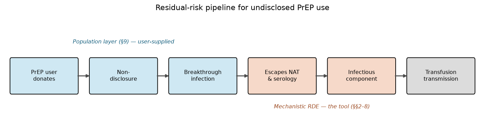
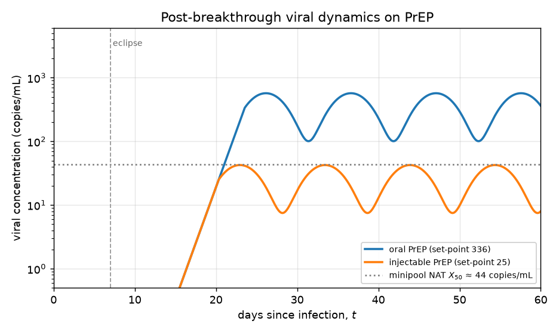
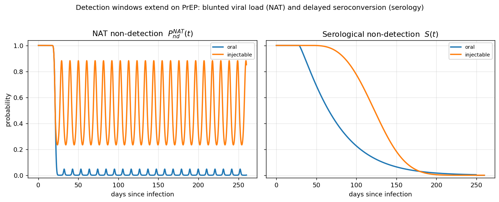
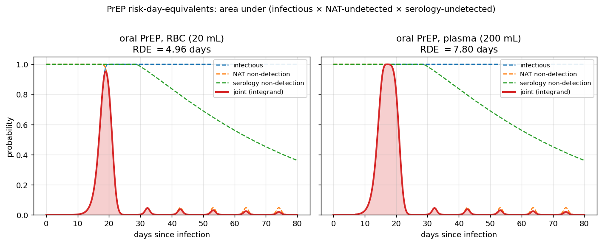

# Technical documentation: residual risk of HIV transfusion transmission from undisclosed PrEP use

*Eduard Grebe — Vitalant Research Institute*

This document is the technical backing for the **PrEP-breakthrough extension** of the
Residual HIV Transfusion Transmission Risk Estimation Tool. It is the companion to the
base-model documentation (`theory.md`), which it assumes throughout: the viral-growth,
dose-response, and NAT-detection machinery developed there is reused here, and only the
PrEP-specific structure is derived in full. It documents the model **as implemented** in
the `residualrisk` Python package (`residualrisk/prep.py`) and its Go acceleration
(`go/riskdays/prep*.go`), and corresponds to the analysis presented at the 35th Regional
ISBT Congress, Milan, June 2025 (Grebe et al., abstract PA28-L04). It is written for a
scientific readership and is intended to support a manuscript reporting this work.

> **Scope.** This document covers the mechanistic **risk-day-equivalents (RDE)** model for
> PrEP-breakthrough infection (the part implemented in the tool), and — for completeness —
> the **population aggregation** that converts those RDEs into a residual-risk estimate.
> The latter ("Layer 2") is *not* part of the tool; it is documented in §9 because the
> published estimates depend on it, but in the tool the user supplies a pre-computed
> ("effective") incidence and the tool's task ends at the RDE.

---

## 1. Overview and motivation

### 1.1 The blood-safety problem

Many blood collectors, including most in the United States, have moved to individual donor
risk-assessment questionnaires that include questions about the use of HIV pre-exposure
prophylaxis (PrEP). A donor taking PrEP who has nonetheless acquired HIV (a *breakthrough*
infection) and who does **not disclose** PrEP use may donate a component that is infectious
but escapes screening. The concern is specific: the antiretroviral drugs in PrEP can both
**suppress the breakthrough viral load** and **delay seroconversion**, degrading the very
assays — nucleic acid testing (NAT) and antibody / antigen-antibody serology — on which
blood screening relies (Ambrosioni et al., 2021; Seed et al., 2021). Undisclosed PrEP use
by blood donors is documented (Custer et al., 2020), and PrEP use in the general population
is substantial and growing (≈ 0.5 M U.S. users in 2023, ~92% male, ~97.5% oral; Mann et
al., 2024). Crucially, an undetectable viral load on PrEP does **not** guarantee
non-infectivity of a transfused component — "undetectable equals untransmittable" is a
statement about sexual transmission on suppressive therapy and does not extend to
transfusion (Gosbell et al., 2019).

### 1.2 The two-layer structure

The published residual-risk estimate is built in two layers, of which only the first is
implemented in the tool (Figure 1 reproduces the conceptual pipeline presented at ISBT):

- **Layer 1 — the mechanistic RDE model (this document, §§2–8).** For a single breakthrough
  infection on PrEP, how long does a donated component remain *infectious yet undetected by
  both NAT and serology*? This "infectious window period," expressed as **risk-day
  equivalents** (RDE), is obtained — exactly as in the base model — by integrating the joint
  probability of being infectious and undetected over time since infection. The PrEP model
  modifies the base model in three ways: the post-breakthrough **viral dynamics** (§3), the
  addition of a **serological detection layer** (§4.2), and an optional antiretroviral
  **drug-effect** factor on transmissibility (§5.2).

- **Layer 2 — the population aggregation (§9).** What fraction of donations come from donors
  who are on PrEP, do not disclose it, and have a breakthrough infection in the window — and
  what is the incidence of breakthrough infection among them? This requires donor-stratum
  PrEP-use prevalence, self-deferral and disclosure rates, and route- and sex-stratified
  incidence. It is operator- and time-specific and is **deliberately outside the tool**
  (see the base documentation's scope note); §9 documents it because the published numbers
  depend on it.

### 1.3 The residual-risk relationship

Writing $\mathrm{RDE}$ for the infectious window in days and following the
incidence × window-period logic of the base model, the per-transfusion residual risk
attributable to undisclosed PrEP use is the sum over PrEP modalities $g \in \{\text{oral},
\text{injectable}\}$ of a breakthrough-donation probability times a window fraction:

$$
RR_\text{PrEP} \;=\; \sum_{g} \pi_g \cdot \frac{\mathrm{RDE}_g}{365.25},
$$

where $\pi_g$ is the probability that a random donation is an **undisclosed, PrEP-$g$,
breakthrough-infected, window-phase** donation (Layer 2, §9) and $\mathrm{RDE}_g$ is the
PrEP-$g$ risk-day-equivalents (Layer 1). The tool computes $\mathrm{RDE}_g$ for one product
at a time; the user supplies $\pi_g$ (or an equivalent effective incidence). This is the
incremental risk *over and above* the baseline (non-PrEP) window-period risk computed by
the base model.

*Figure 1. The risk-assessment pipeline (after Grebe et al., ISBT 2025). A donation
contributes to residual risk only if it traverses every stage: a PrEP user donates, does
not disclose, has a breakthrough infection, that infection escapes both NAT and serology,
and the resulting component is infectious. The tool models the last two stages (the RDE);
the earlier stages are the population layer (§9).*

---

## 2. Notation

The PrEP model reuses the base-model notation (`theory.md`, §2) — in particular $t$ (time
since infection, days), $C(t)$ (viral concentration), $C_0$, $\lambda$ (doubling time),
$\chi$ (copies per virion), $k$ (dose-response parameter), $V_\text{trans}$, $X_{50}$,
$X_{95}$, $z$, $S_\text{pool}$, $m_\text{retest}$, and $\Phi$. The additional symbols are:

| Symbol | Code variable | Description |
|---|---|---|
| $\tau_\text{ecl}$ | `eclipse` | Eclipse duration: delay before viral outgrowth begins (days) |
| $C_\text{sp}$ | `set_point` | Plateau ("set-point") viral concentration on PrEP |
| $t_c$ | `tcrit` | Time at which growth reaches the set-point (plateau onset) |
| $a$ | `a` | Plateau oscillation amplitude (fraction of $C_\text{sp}$) |
| $b$ | `b` | Plateau oscillation angular frequency (rad/day) |
| $o$ | `offset` | Plateau oscillation centre (multiple of $C_\text{sp}$; $o=1$ centres on it) |
| $\delta$ | `drug_effect` | Antiretroviral transmissibility-reduction factor, $\delta\in(0,1]$ |
| $S(t)$ | `_prob_nondetection_serology_prep` | Probability not yet detectable by serology |
| $t_0$ | `ser_min` | Seroconversion onset: earliest serological detectability (days) |
| $t_1$ | `ser_max` | Seroconversion cutoff: serology certain beyond this (days) |
| $\alpha_s$ | `ser_alpha` | Weibull **scale** of the seroconversion-delay distribution (days) |
| $\beta_s$ | `ser_beta` | Weibull **shape** of the seroconversion-delay distribution |
| $\mathrm{RDE}_g$ | `risk_days_prep`, RDE | PrEP-$g$ infectious window period (risk-day equivalents) |

Concentrations are in the same units as the base model ($C$ in virions/mL, with $n=\chi C
V_\text{trans}$ giving RNA copies). The set-point default (§10) is taken from clinically
reported breakthrough viral loads in copies/mL; the model treats it as a value of $C$.
*[Reviewer note: confirm the intended copies-vs-virions convention for $C_\text{sp}$; the
factor $\chi$ is applied consistently downstream as in the base model.]*

---

## 3. Post-breakthrough viral dynamics

### 3.1 A three-phase trajectory

The base model assumes log-linear viral growth from infection to saturation. On PrEP, the
breakthrough infection is partially suppressed, so the viral load does not climb to a high
acute peak; instead it is capped at a (frequently low) **set-point** and then fluctuates.
The implemented trajectory (`_vl_postbt`) has three phases:

$$
C(t) =
\begin{cases}
0, & t < \tau_\text{ecl} \quad\text{(eclipse)} \\[4pt]
C_0\, 2^{(t-\tau_\text{ecl})/\lambda}, & \tau_\text{ecl} \le t \le t_c \quad\text{(growth)} \\[4pt]
C_\text{sp}\,\big(o + a\sin\!\big(b\,(t-t_c)\big)\big), & t > t_c \quad\text{(oscillating plateau)}
\end{cases}
$$

clamped to a physical floor of zero, $C(t)\leftarrow\max(0, C(t))$. The growth phase is the
base model's exponential ramp (Fiebig et al., 2003), delayed by the eclipse period
$\tau_\text{ecl}$. Growth gives way to the plateau at the **critical time** $t_c$, defined
as the moment growth first reaches the set-point. Solving $C_0\,2^{(t_c -
\tau_\text{ecl})/\lambda} = C_\text{sp}$ in closed form (`_find_tcrit`):

$$
t_c \;=\; \tau_\text{ecl} \;+\; \lambda\,\log_2\!\big(C_\text{sp}/C_0\big).
$$

This closed form replaced an earlier grid search (and is reproduced exactly in Go as
`FindTcrit`, so the two backends agree to machine precision). The growth exponential is
deliberately **not** evaluated on the plateau branch: for a small sampled doubling time it
would overflow far out in time, and the value would only be discarded.

### 3.2 The oscillating plateau and its rationale

On the plateau the viral concentration is the set-point modulated by a sinusoid
(`_sin_varied`),

$$
C(t) = C_\text{sp}\,\big(o + a\sin(b\,(t-t_c))\big),
$$

so it oscillates between $(o-a)\,C_\text{sp}$ and $(o+a)\,C_\text{sp}$ with period
$2\pi/b$. With the production values $o=1,\ a=0.7$ the plateau oscillates between $0.3\,
C_\text{sp}$ and $1.7\,C_\text{sp}$. The amplitude must satisfy $a \le o$, since $a>o$ would
drive the modelled concentration negative on the downswings (it is then clamped to zero);
this constraint is enforced in both backends and in the UI.

The oscillation represents the **intermittent, fluctuating viraemia** characteristic of a
breakthrough infection on partially effective PrEP: rather than a stable set-point, the
viral load rises and falls — plausibly tracking fluctuating drug levels under imperfect
adherence — so that a standard assay may detect the infection at a peak and miss it in a
trough. This is consistent with the clinical picture of blunted, sometimes transiently
undetectable, viraemia on PrEP (Ambrosioni et al., 2021; Seed et al., 2021). The sinusoid
is a phenomenological device that produces this behaviour with two interpretable parameters;
it is **not** a mechanistic pharmacodynamic model (see §11, and the deferred drug-concentration
work).

Figure 2 shows the trajectory for the oral and injectable set-points. The much lower
injectable set-point keeps the plateau near — and intermittently below — the NAT detection
threshold (§4.1), which is central to the difference between the two modalities (§7).

*Figure 2. Modelled post-breakthrough viral concentration $C(t)$ for oral PrEP
($C_\text{sp}=336$) and injectable PrEP ($C_\text{sp}=25$): an eclipse phase, exponential
outgrowth to the set-point at $t_c$, then an oscillating plateau ($a=0.7$, $b=0.6$, $o=1$).
The minipool NAT detection threshold ($S_\text{pool}\,X_{50}$, in copies) is shown for
reference; the injectable plateau sits close to it, so detection is unreliable there.*

---

## 4. Detection on PrEP: NAT and serology

A donation is *not detected* — and so can be released — only if it escapes **both** the NAT
screen and the serological screen. The PrEP model therefore multiplies two independent
non-detection probabilities. The NAT layer is taken unchanged from the base model; the
serological layer is new.

### 4.1 NAT non-detection

The probability of escaping NAT, $P_\text{nd}^\text{NAT}(t)$, is exactly the base model's
minipool-plus-retest probit (`theory.md` §3.3; implemented via the shared
`_prob_pos_init` / `_prob_neg_retest`), evaluated on the PrEP viral-load trajectory $C(t)$
of §3 rather than on pure exponential growth:

$$
P_\text{nd}^\text{NAT}(t) = 1 - P_{+,\text{init}}(t)\,\big(1 - P_{-,\text{retest}}(t)\big),
$$

with $P_{+,\text{init}}$ the probit detection probability for the diluted minipool sample
and $P_{-,\text{retest}}$ the probability that all individual-donation retests are negative.
Because $C(t)$ on PrEP can plateau at a low level, $P_\text{nd}^\text{NAT}(t)$ does **not**
necessarily fall to zero after outgrowth, as it does in the base model: at the injectable
set-point the diluted plateau concentration straddles $X_{50}$, so a substantial NAT
non-detection probability persists across the whole plateau (and oscillates with $C(t)$).

### 4.2 Serological non-detection (delayed seroconversion)

The serological screen detects anti-HIV antibodies (or p24 antigen) once the donor
seroconverts. On PrEP this is delayed. The probability that a donor infected at $t=0$ has
**not yet** become serologically detectable at time $t$ is modelled as a *shifted Weibull
survival function* (`_prob_nondetection_serology_prep`):

$$
S(t) =
\begin{cases}
1, & t < t_0 \\[2pt]
\exp\!\Big(-\big((t-t_0)/\alpha_s\big)^{\beta_s}\Big), & t_0 \le t \le t_1 \\[2pt]
0, & t > t_1 ,
\end{cases}
$$

i.e. serology cannot detect before an onset time $t_0$ (`ser_min`), follows a Weibull
seroconversion-delay distribution with scale $\alpha_s$ and shape $\beta_s$ thereafter, and
is taken as certain beyond a cutoff $t_1$ (`ser_max`). $S(t)$ is the complementary CDF of a
Weibull seroconversion *delay* measured from the onset $t_0$.

**Derivation of the Weibull parameters.** The delay is anchored to the interval between the
**first NAT-reactive result and the first confirmatory antibody-positive visit** in
documented PrEP breakthrough seroconverters (Seed et al., 2021). For oral PrEP this interval
ranged from 3.1 to 30.3 weeks. The onset, median, and an upper quantile are set from these
data (taking onset $= \tau_\text{ecl}^{\,(\text{sero})} + 1 + 3.1{\times}7 = 28.7$ days for
oral), and the scale $\alpha_s$ and shape $\beta_s$ are then fitted to approximate a target
median and high quantile of the seroconversion delay (the fit is in
`residualrisk_analysis/exploration/scripts/weibull_serology_nondetection.R`). The median and
upper-quantile columns below are the values the **fitted** $(\alpha_s,\beta_s)$ actually
produce (time from infection to serological detectability), which the fit approximates rather
than hits exactly:

| Modality | $t_0$ (onset) | median delay | upper quantile | $\alpha_s$ (scale) | $\beta_s$ (shape) | $t_1$ (cutoff) |
|---|---|---|---|---|---|---|
| Oral PrEP | 28.7 d | ≈ 65.4 d | ≈ 219 d (p99) | 50.49434 | 1.15062 | 250 d |
| Injectable PrEP | 42 d | ≈ 122.6 d | ≈ 192 d (p99) | 90.88988 | 3.048339 | 250 d |

The oral fit is nearly exponential ($\beta_s \approx 1.15$), reflecting a wide,
right-skewed delay; the injectable fit is markedly later and steeper ($\beta_s \approx
3.05$), reflecting the longer, more concentrated seroconversion delay seen with long-acting
injectable PrEP. Figure 3 shows both curves.

Note that the serology onset $t_0$ is placed using a 6-day eclipse assumption (in dating the
first NAT-reactive result), whereas the RDE viral-dynamics model uses $\tau_\text{ecl}=7$ days
(range 4–10). These are distinct constructs — one fixes the absolute origin of the
seroconversion-delay data, the other governs the modelled viral outgrowth — and the one-day
difference shifts $t_0$ by a day at most, immaterial against a seroconversion window spanning
months.

### 4.3 The combined screen

A window-phase PrEP donation escapes detection only if it is NAT-negative *and*
serology-negative. Assuming the two screens are conditionally independent given the viral
trajectory, the joint non-detection probability is the product
$P_\text{nd}^\text{NAT}(t)\,S(t)$. On PrEP both windows are extended — NAT by the low,
fluctuating viral load and serology by delayed seroconversion — so their product keeps a
donation potentially releasable for far longer than in the base (NAT-only, high-VL) model.

*Figure 3. Non-detection probabilities versus time since infection. NAT non-detection
$P_\text{nd}^\text{NAT}(t)$ (for the oral and injectable set-points) falls then, on the
low injectable plateau, remains substantial and oscillates; serological non-detection
$S(t)$ is a delayed Weibull survival (oral vs injectable). A donation escapes screening only
where both are appreciable.*

---

## 5. Infectivity and the antiretroviral drug effect

### 5.1 Dose-response

The probability that a window-phase component is infectious is the base-model single-hit
dose-response (Belov et al., 2023) evaluated on the PrEP trajectory, $n(t)=\chi\,C(t)\,
V_\text{trans}$:

$$
P_\text{inf}^{0}(t) = 1 - \exp\!\big(-k\,\chi\,C(t)\,V_\text{trans}\big).
$$

As in the base model, the dose-response parameter $k$ is the single most influential
input. The PrEP analyses use the **animal-derived** posterior for $k$ (the higher-infectivity
estimate; §10), although the tool accepts any of the base model's input distributions for
$k$ (posterior sample, inverse gamma, lognormal mixture; `theory.md` §5.2). The choice of
$k$ distribution dominates the residual-risk estimate even more strongly than it does in the
base model (§10.4).

### 5.2 The drug-effect transmissibility factor

Residual antiretroviral drug in the transfused plasma may reduce the probability that a
given infectious dose establishes infection in the recipient. This is modelled as a
multiplicative **transmissibility-reduction factor** $\delta\in(0,1]$ applied to the
per-time infection probability (`_drug_effect`):

$$
P_\text{inf}^\text{PrEP}(t) = \delta(t)\cdot\Big(1 - \exp\!\big(-k\,\chi\,C(t)\,V_\text{trans}\big)\Big),
$$

with $\delta=1$ meaning no reduction and a reduction fraction $1-\delta$. In the current
implementation $\delta$ is **constant in $t$**, so it factors out of the RDE integral and is
numerically identical to scaling the final RDE — which is how the original analysis applied
it (as a scalar on the per-donation risk). It is nonetheless written *inside* the integrand,
taking $t$ as an argument, deliberately: breakthrough infections on long-acting injectable
PrEP typically occur as the drug **washes out**, so a faithful model would let $\delta(t)$
relax toward 1 across the window as drug concentration decays — at which point it no longer
factors out, and the in-integrand placement is the only correct one. Promoting $\delta$ to a
genuine function of $t$ is the deferred PK/PD extension (§11).

**Parameter values.** The production tool defaults to $\delta=1$ (no drug effect, leaving
the RDE unchanged). The published ISBT analysis used a transmissibility factor of $\delta=
0.75$ as its central value (a "25% reduction") and $\delta\sim\mathcal{U}(0.5,1.0)$ in the
uncertainty analysis (equivalently, a reduction $1-\delta\sim\mathcal{U}(0,0.5)$, central
25%). This value is an assumption, not a measured quantity (§11).

---

## 6. The PrEP infectious window period (RDE)

Combining §§3–5, the PrEP risk-day-equivalents for modality $g$ and a given product is the
integral of the joint probability of being **infectious and undetected by both screens**
(`_risk_days_prep`):

$$
\mathrm{RDE}_g \;=\; \int_{-\infty}^{\infty}
\underbrace{\delta\,\big(1-e^{-k\chi C(t)V_\text{trans}}\big)}_{\text{infectious}}\;
\underbrace{P_\text{nd}^\text{NAT}(t)}_{\text{NAT-negative}}\;
\underbrace{S(t)}_{\text{serology-negative}}\; dt .
$$

The integrand has **compact support**: it is exactly zero before the eclipse
($P_\text{inf}=0$ while $C=0$) and again beyond the serology cutoff ($S=0$ for $t>t_1$), so
the effective domain is $[\tau_\text{ecl},\,t_1]$. This compactness is the reason the
implementation integrates with a **fixed 1000-point Gauss–Legendre rule** over $[-100,500]$
rather than adaptive quadrature: on a compact-support integrand, adaptive
`scipy.integrate.quad` can place its initial nodes outside the active window and silently
return $\approx 0$ (it does so on a narrow serology window: at $(\alpha_s,\beta_s)=(9.1,5.2)$
the true RDE $\approx 1.0086$ but `quad` returns $5\times10^{-18}$). The Gauss–Legendre rule
samples the whole interval and cannot miss the window; at the production serology defaults
the two methods agree to ~6 significant figures (the published analysis used `quad`, whose
results are reproduced; see §10). The numerical guards and Go/Python RNG independence are as
in the base model (`theory.md` §4).

Figure 4 shows the integrand as the product of its three factors, the area under which is
the RDE.

*Figure 4. Construction of the PrEP RDE, shown for oral PrEP with an RBC unit (20 mL
plasma, left) and a plasma unit (200 mL, right). The integrand (shaded) is the product of
infectivity (rising once outgrowth begins), NAT non-detection (falling as the load grows),
and serological non-detection (the delayed Weibull survival); its area is the
risk-day-equivalents. The larger plasma volume raises the transfused dose and lengthens the
window (RDE ≈ 4.96 vs 7.80 days at these nominal parameters). The window is bounded below by
the eclipse and above by the serology cutoff. The small later bumps are troughs of the
oscillating plateau where NAT detection momentarily weakens.*

---

## 7. Oral versus injectable PrEP

The two PrEP modalities are modelled as **independent scenarios** that are combined
**additively** on top of the baseline window-period risk; the tool computes each
separately. Only two model components differ between them — the viral set-point and the
seroconversion-delay Weibull — with everything else (eclipse, growth, oscillation shape
$a,b,o$, NAT parameters, dose-response, volumes) shared:

| Component | Oral PrEP (oPrEP) | Injectable PrEP (iPrEP) |
|---|---|---|
| Set-point $C_\text{sp}$ (point) | 336 | 25 |
| Set-point range (Uniform) | $(19.1,\ 2265)$ | $(5,\ 2500)$ |
| Serology onset $t_0$ | 28.7 d | 42 d |
| Serology cutoff $t_1$ | 250 d | 250 d |
| Serology scale $\alpha_s$ | 50.49434 | 90.88988 |
| Serology shape $\beta_s$ | 1.15062 | 3.048339 |
| (median seroconversion delay) | ≈ 65.4 d | ≈ 122.6 d |
| Eclipse, $a$, $b$, $o$, NAT, $k$, volumes | shared | shared |

The two differences pull in the same direction operationally. Injectable PrEP suppresses the
viral load far more strongly (set-point ~13× lower), so its plateau sits at or below the NAT
threshold and NAT non-detection persists; and it delays seroconversion substantially longer.
Both extend the infectious-yet-undetected window, giving injectable PrEP a longer upper tail
of RDE values (§10.2). They also reorder the drivers of the RDE: for **oral** PrEP, where the
plateau is well above the minipool NAT threshold, the **set-point** is the dominant driver
(it determines whether and when NAT detects); for **injectable** PrEP, where NAT fails across
the low plateau regardless, the **transfused volume** and **$k$** dominate (§10.4).

**Structural caveat.** The oscillating-set-point viral model is most appropriate for
**sub-optimal-adherence oral PrEP**, where intermittent drug exposure produces fluctuating
viraemia around a partially-suppressed plateau. It is a weaker description of **injectable
PrEP**, where breakthrough typically occurs during drug **wash-out** and the natural history
is closer to a (delayed) approach to a normal set-point as protection wanes. A more faithful
injectable model would couple the viral load and the drug effect to a decaying
drug-concentration trajectory (§11).

---

## 8. Uncertainty analysis

Point estimates of the RDE are obtained by evaluating the model at the primary parameter
values; credible intervals are obtained by Monte Carlo, exactly as in the base model
(`theory.md` §5). In each of $n_\text{bs}$ iterations (default 10,000) a parameter set is
drawn from the following distributions (`risk_days_prep_bs`):

| Parameter | Distribution | Notes |
|---|---|---|
| $k$ (infectivity) | per the chosen input distribution (§5.1) | animal posterior in the published analysis |
| $\lambda$ (doubling time) | positive-truncated normal | shared base sampler |
| $X_{50}$ (50% LoD) | positive-truncated normal | $X_{95}/X_{50}$ held fixed |
| $C_\text{sp}$ (set-point) | $\mathcal{U}(C_\text{sp,min}, C_\text{sp,max})$ | modality-specific range |
| $\tau_\text{ecl}$ (eclipse) | $\mathcal{U}(4, 10)$ | |
| $V_\text{trans}$ (volume) | $\mathcal{U}(V_\text{min}, V_\text{max})$ | product-specific |
| $a,\ b$ (oscillation) | fixed (optional $\mathcal{U}$) | fixed in the published analysis |
| $\delta$ (drug effect) | fixed (optional $\mathcal{U}$) | see §5.2 |
| $o$ (offset) | fixed | never varied |
| $t_0,\ t_1,\ \alpha_s,\ \beta_s$ (serology) | fixed | modality-specific (§4.2) |

Several points are worth noting:

- **The serology curve and the dose-response are single fixed curves**, not resampled per
  iteration; uncertainty enters the RDE through the viral-dynamics, volume, and assay
  parameters (and through $k$ via its input distribution). This matches the published
  analysis.
- **The oscillation parameters $a,b$ and the drug effect $\delta$ are fixed by default.** The
  implementation optionally samples each from a uniform range
  (`a_dist_uniform`, `b_dist_uniform`, `drug_effect_dist_uniform`); the offset $o$ is never
  varied, and $a$ (and any sampled upper bound) must not exceed $o$ (§3.2).
- **The positivity correction applies here too.** The doubling time and LoD are drawn from
  *positive-truncated* normals via the shared `_sample_positive_normal` (truncating at zero,
  not at the mean). The original PrEP analysis used the un-corrected truncation, which
  truncated at the mean and inflated those parameters; correcting it lowers the PrEP RDE (and
  hence the risk) by a uniform ≈ 6% at the production parameter set (§10.3).

Point estimates (primary-parameters / median / mean / KDE-log mode) and credible intervals
are computed exactly as in the base model (`theory.md` §§5.3–5.4).

---

## 9. From RDE to residual risk: the population layer

This section documents Layer 2 — the population aggregation that the published estimates
use. **It is not implemented in the tool**: the tool produces $\mathrm{RDE}_g$ and the user
supplies the breakthrough-donation probability $\pi_g$ (or an effective incidence). It is
recorded here because the published residual-risk figures (§10.3) depend on it, and a
sophisticated user reproducing them will build it on the Python API.

### 9.1 The undisclosed-breakthrough-donation probability

For each PrEP modality $g$, the probability that a random donation is an undisclosed,
breakthrough-infected, window-phase PrEP donation is assembled across donor strata $s$
(first-time / repeat × male / female):

$$
\pi_g \;=\; \frac{1}{N_\text{don}} \sum_{s} N_s\,\big(1-r_\text{sd}\big)\big(1-r_\text{disc}\big)\,u_{g,s}\,\hat I_{g,s},
$$

where $N_s$ is the annual donation count in stratum $s$, $u_{g,s}$ the PrEP-$g$ use
prevalence in that stratum, $\hat I_{g,s}$ the breakthrough-infection incidence among PrEP-$g$
users in that stratum, $r_\text{sd}$ the self-deferral rate (fraction of PrEP-using donors
who do not present), $r_\text{disc}$ the disclosure/discard rate (fraction of the rest whose
PrEP use is disclosed and the donation discarded), and $N_\text{don}=\sum_s N_s$. The
per-product residual risk per million transfusions is then

$$
RR_\text{product} = \Big(\pi_\text{oral}\,\tfrac{\mathrm{RDE}^\text{oral}_\text{product}}{365.25} + \pi_\text{inj}\,\tfrac{\mathrm{RDE}^\text{inj}_\text{product}}{365.25}\Big)\cdot \delta \cdot 10^6 .
$$

Here $\mathrm{RDE}^g_\text{product}$ is the **drug-effect-free** ($\delta=1$)
risk-day-equivalents, and the transmissibility factor $\delta$ is applied **once**, as the
external multiplier shown — the convention of the published Layer-2 analysis, which drew
$\delta$ as a Layer-2 quantity (§9.2). Equivalently, and as the tool does by default, $\delta$
may be folded into $\mathrm{RDE}^g$ through the integrand (§5.2, §6, where it factors out
because it is constant in $t$); because the two are numerically identical, $\delta$ must be
applied in **one** place only, never both. (If oral and injectable use different
antiretrovirals, they take separate $\delta_g$ inside their respective terms rather than the
single common $\delta$ written here.)

### 9.2 Layer-2 priors (published analysis)

The published analysis used U.S. donor and PrEP-use data with the following inputs (donor
counts are operator-specific annual totals); the uncertainty analysis drew $n_\text{bs}=
100{,}000$ Monte Carlo samples:

| Quantity | Value / prior |
|---|---|
| Donations: FT male / FT female / repeat male / repeat female | 846,481 / 902,446 / 4,546,545 / 4,847,143 (total 11,142,615) |
| Male oral PrEP-use prevalence | $\mathcal{N}(0.00373,\ 0.001865)$ (50% RSE) |
| Male injectable PrEP-use prevalence | $\mathcal{N}(9.03{\times}10^{-5},\ 4.52{\times}10^{-5})$ |
| Female : male use ratio (oral / injectable) | $1/12$ / $1/6$ |
| Repeat : first-time use ratio | $1/13$ |
| Breakthrough incidence, male oral (per PY) | $\sim$ truncated $\mathcal{N}(0.009925,\ 0.0049625)$ on $[0, 0.02]$ |
| Incidence: female:male / injectable:oral ratio | $1.0$ / $0.33$ |
| Self-deferral rate $r_\text{sd}$ | $\mathcal{U}(0.1,\ 0.7)$ |
| Disclosure/discard rate $r_\text{disc}$ | $\mathcal{U}(0.5,\ 0.75)$ |
| Drug-effect factor $\delta$ | $\mathcal{U}(0.5,\ 1.0)$ |

The incidence inputs are deflated by 50% relative to the source estimates to reflect lower
expected incidence among donors than in PrEP-trial populations; their provenance is an
assumption (§11). PrEP-use prevalence is anchored to 2023 U.S. prescription data (Mann et
al., 2024).

---

## 10. Default parameters and worked results

### 10.1 Production parameters

The mechanistic (Layer 1) parameters used in the published analysis, common to all products
unless noted:

| Parameter | Value | Distribution | Source / note |
|---|---|---|---|
| $C_0$ | 0.00025 | fixed | base model |
| $\lambda$ | 0.8542 d | $\mathcal{N}(0.8542, 0.0553)$, trunc. $>0$ | Fiebig et al. (2003) |
| $\tau_\text{ecl}$ | 7.0 d | $\mathcal{U}(4, 10)$ | |
| $a$, $b$, $o$ | 0.7, 0.6, 1 | fixed | oscillation shape |
| $k$ | animal posterior median 0.024464 | $\Gamma$ fit to animal posterior (shape 4.005, scale 0.006739) | Belov et al. (2023); animal data |
| $X_{50}$ | 2.73 c/mL ($=4.7/1.72$ IU) | $\mathcal{N}(2.73, \cdot)$, trunc. $>0$ | $1.72$ IU/copy (WHO) |
| $X_{95}/X_{50}$ | $21.2/4.7 = 4.51$ | fixed | |
| $S_\text{pool}$, $m_\text{retest}$ | 16, 1 | fixed | minipool NAT |
| $\chi$, $z$ | 2, 1.6449 | fixed | |
| $C_\text{sp}$ (oral / inj) | 336 / 25 | $\mathcal{U}(19.1,2265)$ / $\mathcal{U}(5,2500)$ | Seed et al. (2021); §7 |
| Serology (oral / inj) | see §4.2 | fixed | Seed et al. (2021) |
| $V_\text{trans}$ (RBC / plasma) | 20 / 200 mL | $\mathcal{U}(15,50)$ / $\mathcal{U}(180,300)$ | |
| $\delta$ | 0.75 (published) / 1.0 (tool default) | $\mathcal{U}(0.5,1.0)$ | §5.2 |

The oral set-point default, 336, is the median of the eight per-case breakthrough viral
loads reported for oral TDF/FTC seroconverters (Seed et al., 2021); its range spans the
lowest single-copy-assay value to the median of the poorer-adherence cases. The injectable
set-point (25; range 5–2500) reflects more strongly suppressed viraemia but has weaker
direct provenance in the source data (§11).

### 10.2 Risk-day-equivalents

Bootstrap RDE distributions (days; $n_\text{bs}=10{,}000$; animal-$k$; published analysis):

| PrEP form | Product | Range | 95% credible interval | Mean | Median |
|---|---|---|---|---|---|
| Oral | RBC | 1.9–40.3 | 3.7–13.2 | 6.0 | 5.5 |
| Oral | Plasma | 4.0–42.9 | 6.5–16.0 | 8.7 | 8.2 |
| Injectable | RBC | 2.1–99.1 | 4.0–24.6 | 7.1 | 5.7 |
| Injectable | Plasma | 4.0–104.7 | 6.5–28.0 | 9.8 | 8.2 |

The injectable windows have the longer upper tails (§7). These RDEs are ~5–10 days — far
longer than the base (non-PrEP) NAT window — because PrEP extends both detection windows.

### 10.3 Residual-risk estimates

Applying Layer 2 (§9), the published incremental residual-risk estimates were (1 in $x$
million transfusions; median with 95% credible interval):

| Scenario | RBC | Increase over baseline | Plasma | Increase over baseline |
|---|---|---|---|---|
| Baseline (no PrEP) | 1 in 8.5 M | — | 1 in 5.2 M | — |
| Base case | 1 in 110 M (24–1,405) | +7.7% | 1 in 75 M (17–942) | +6.9% |
| Most-likely case | 1 in 107 M | +7.9% | 1 in 73 M | +7.1% |
| Worst case | 1 in 17 M | +50% | 1 in 14 M | +37% |

The headline conclusion is that **undisclosed PrEP use adds a small increment** — on the
order of a few percent — to an already very low baseline transfusion-transmission risk, under
base-case assumptions.

The current tool reproduces this pipeline. End-to-end validation against the frozen analysis
outputs (the `residualriskapp_validation` repository, driving the Go engine) reproduces the
ISBT 2025 base case to within rounding — RBC 1 in 110.8 M (CrI 24–1,437), plasma 1 in 74.6 M
(CrI 17–968) — using the original (un-corrected) sampling. With the positivity correction
(§8) the tool gives ≈ 6% *safer* figures (RBC 1 in 119 M, plasma 1 in 79 M), the expected
shift.

### 10.4 Sensitivity

The published sensitivity (tornado) analysis ranked the drivers as follows.

- **RDE, oral PrEP:** set-point > $k$ > plasma volume > doubling time > NAT LoD > eclipse.
- **RDE, injectable PrEP:** plasma volume > $k$ > NAT LoD > doubling time > eclipse > set-point.
- **Residual risk:** oral PrEP-use prevalence > breakthrough incidence > oral RDE >
  disclosure rate > drug effect > injectable RDE > injectable PrEP-use prevalence.

Two points dominate. First, within the RDE the **set-point/volume and $k$** lead, with their
order swapping between modalities (§7). Second — and not captured in the published tornado,
which fixed the $k$ distribution — the **choice of input distribution for $k$** is the single
largest lever on the final estimate: substituting the human-anchored inverse-gamma default
for the animal posterior lowers the residual risk by roughly a factor of three (RBC from ~1
in 119 M to ~1 in 357 M). Any application should report this sensitivity first (consistent
with the base model, `theory.md` §5.2).

---

## 11. Assumptions and limitations

The PrEP extension is, by the nature of the problem, more assumption-driven than the base
model, and the published work flags this explicitly. The principal caveats:

- **Suppressed-viraemia and delayed-seroconversion modelling is assumption-driven.** The
  three-phase trajectory, the oscillating plateau, and the Weibull seroconversion delay are
  phenomenological choices calibrated to limited breakthrough-seroconverter data (Seed et
  al., 2021; Ambrosioni et al., 2021). They are not derived from a pharmacological model.
- **The oscillating-plateau model fits oral better than injectable PrEP.** For injectable
  PrEP, breakthrough during drug wash-out is better described by a decaying drug
  concentration driving the viral load and the protective effect together (the deferred
  PK/PD extension); the current $\delta$ is constant in $t$ and the set-point is static.
- **The drug-effect value is an assumption.** The 25% central transmissibility reduction
  ($\delta=0.75$; $\mathcal{U}(0.5,1.0)$) is not grounded in transfusion-specific data.
- **The injectable set-point has weaker provenance** than the oral set-point (§10.1).
- **Population-layer inputs are uncertain.** Breakthrough incidence among PrEP users, and
  PrEP use and disclosure rates among blood donors, are difficult to measure; the incidence
  figures and the 50% donor deflation are assumptions (§9.2). These population inputs — not
  the RDE — dominate the residual-risk estimate (§10.4), so the headline numbers should be
  read as order-of-magnitude.
- **Independence assumptions.** NAT and serological detection are treated as conditionally
  independent given the viral trajectory, and bootstrap parameters are drawn independently
  (as in the base model).
- **Dynamics will change with injectable uptake.** Injectable PrEP, currently a small share
  of use, carries the longer windows; the risk profile will shift if its uptake grows.

---

## 12. References

- Ambrosioni J, Petit E, Liegeon G, Laguno M, Miró JM. Primary HIV-1 infection in users of
  pre-exposure prophylaxis. *Lancet HIV.* 2021;8(3):e166-e174.
  doi:[10.1016/S2352-3018(20)30271-X](https://doi.org/10.1016/S2352-3018(20)30271-X).
- Belov A, Yang H, Forshee RA, et al. Modeling the risk of HIV transfusion transmission.
  *J Acquir Immune Defic Syndr.* 2023;92(2):173-179.
  doi:[10.1097/QAI.0000000000003115](https://doi.org/10.1097/QAI.0000000000003115).
- Custer B, Quiner C, Haaland R, et al. HIV antiretroviral therapy and prevention use in US
  blood donors: a new blood safety concern. *Blood.* 2020;136(11):1351-1358.
  *(Undisclosed PrEP use among blood donors.)*
- Eshleman SH, et al. Detection of HIV infection in the context of long-acting injectable
  PrEP. *Conference on Retroviruses and Opportunistic Infections (CROI).* 2023. *(Conference
  presentation; full citation to be confirmed.)*
- Fiebig EW, Wright DJ, Rawal BD, et al. Dynamics of HIV viremia and antibody seroconversion
  in plasma donors. *AIDS.* 2003;17(13):1871-1879.
  doi:[10.1097/00002030-200309050-00005](https://doi.org/10.1097/00002030-200309050-00005).
- Gosbell IB, Hoad VC, Styles CE, Lee J, Seed CR. Undetectable does not equal untransmittable
  for HIV and blood transfusion. *Vox Sang.* 2019.
  doi:[10.1111/vox.12790](https://doi.org/10.1111/vox.12790).
- Grebe E, Busch MP, Notari EP, et al. HIV incidence in US first-time blood donors and
  transfusion risk with a 12-month deferral for men who have sex with men. *Blood.*
  2020;136(11):1359-1367.
  doi:[10.1182/blood.2020007003](https://doi.org/10.1182/blood.2020007003).
- Mann LM, et al. Characteristics of persons prescribed oral and injectable PrEP — United
  States, January 2023 through December 2023. *JAMA.* 2024;332(18):1580-1583.
- Seed CR, Styles CE, Hoad VC, Yang H, Thomas MJ, Gosbell IB. Effect of HIV pre-exposure
  prophylaxis (PrEP) on detection of early infection and its impact on the appropriate
  post-PrEP deferral period. *Vox Sang.* 2021;116(4):379-387.
  doi:[10.1111/vox.13011](https://doi.org/10.1111/vox.13011).
- Weusten J, Vermeulen M, van Drimmelen H, Lelie N. Refinement of a viral transmission risk
  model for blood donations in seroconversion window phase screened by nucleic acid testing
  in different pool sizes and repeat test algorithms. *Transfusion.* 2011;51(1):203-215.
  doi:[10.1111/j.1537-2995.2010.02804.x](https://doi.org/10.1111/j.1537-2995.2010.02804.x).

*See the base-model documentation (`theory.md`) for the full base bibliography and for the
shared viral-growth, dose-response, NAT-detection, $k$-distribution, and numerical methods.*

---

*This documentation describes the PrEP-breakthrough extension as implemented in the current
`residualrisk` library (PrEP model, `prep.py` / `prep*.go`; see the app sidebar for the exact
version numbers in this deployment) and corresponds to the analysis presented at ISBT 2025
(Grebe et al., PA28-L04). It is a first draft for review; the remaining passage marked
"Reviewer note" flags a point requiring confirmation.*
